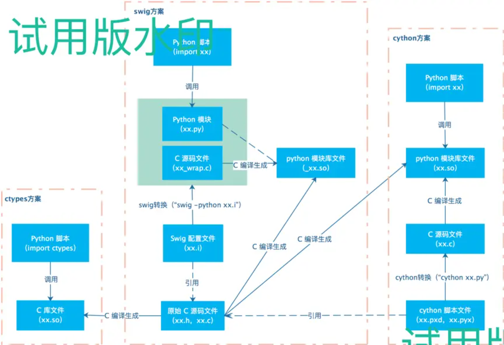

> 注：这是2018年2月写的旧博文，转载到此。

事先声明，标题没有把“Python”错打成“Cython”，因为要讲的就是名为“Cython”的东西。

[Cython](http://cython.org/)是让Python脚本支持C语言扩展的编译器，Cython能够将Python+C混合编码的.pyx脚本转换为C代码，主要用于优化Python脚本性能或Python调用C函数库。由于Python固有的性能差的问题，用C扩展Python成为提高Python性能常用方法，Cython算是较为常见的一种扩展方式。

我们可以对比一下业界主流的几种Python扩展支持C语言的方案：


[ctypes](https://docs.python.org/2/library/ctypes.html)是Python标准库支持的方案，直接在Python脚本中导入C的.so库进行调用，简单直接。[swig](http://www.swig.org/translations/chinese/index.html)是一个通用的让高级脚本语言扩展支持C的工具，自然也是支持Python的。ctypes没玩过，不做评价。以c语言程序性能为基准的话，cython封装后下降20%，swig封装后下降70%。功能方面，swig对结构体和回调函数都要使用typemap进行手工编写转换规则，typemap规则写起来略复杂，体验不是很好。cython在结构体和回调上也要进行手工编码处理，不过比较简单。

# Cython简单实例 #
我们尝试用Cython，让Python脚本调用C语言写的打印“Hello World”的函数，来熟悉一下Cython的玩法。
```
/*filename: hello_world.h */
void print_hello_world();
```
```
/*filename: hello_world.c */
#include <stdio.h>
#include "hello_world.h"

void print_hello_world()
{
    printf("hello world...");
}

int main(int arch, char *argv[])
{
    print_hello_world();
    return (0);
}
```
```
#file: hello_world.pyx

cdef extern from "hello_world.h":
    void print_hello_world()

def cython_print_hello_world():
    print_hello_world()
```
```
#filename: Makefile
all: hello_world cython_hello_world

hello_world:
    gcc hello_world.c -c hello_world.c
    gcc hello_world.o -o hello_world 

cython:
    cython cython_hello_world.pyx

cython_hello_world: cython
    gcc cython_hello_world.c -fPIC -c
    gcc -shared -lpython2.7 -o cython_hello_world.so hello_world.o cython_hello_world.o

clean:
    rm -rf hello_world hello_world.o cython_hello_world.so cython_hello_world.c cython_hello_world.o
```
用Cython扩展C，最重要的就是编写.pyx脚本文件。.pyx脚本是Python调用C的桥梁，.pyx脚本中即能用Python语法写，也可以用类C语法写。
```
$ make all    # 详细的编译过程可以看Makefile中的相关指令
$ python
>>> import cython_hello_world
>>> cython_hello_world.cython_print_hello_world()
hello world...
>>>
```
可以看到，我们成功的在Python解释器中调用了C语言实现的函数。

# Cython的注意事项
所有工具/语言的简单使用都是令人愉快的，但是深入细节就会发现处处“暗藏杀机”。最近是项目需要扩展C底层库给Python调用，所以引入了Cython。实践过程中踩了很多坑，熬了很多夜T_T。遇到了以下几点需要特别注意的点：
>1. .pyx中用cdef定义的东西，除类以外对.py都是不可见的；

>2. .py中是不能操作C类型的，如果想在.py中操作C类型就要在.pyx中从python object转成C类型或者用含有set/get方法的C类型包裹类；

>3. 虽然Cython能对Python的str和C的“char *”之间进行自动类型转换，但是对于“char a[n]”这种固定长度的字符串是无法自动转换的。需要使用Cython的libc.string.strcpy进行显式拷贝；

>4. 回调函数需要用函数包裹，再通过C的“void *”强制转换后才能传入C函数。

## 1. .pyx中用cdef定义的类型，除类以外对.py都不可见
我们来看一个例子：
```
#file: invisible.pyx
cdef inline cdef_function():
    print('cdef_function')

def def_function():
    print('def_function')

cdef int cdef_value

def_value = 999

cdef class cdef_class:
    def __init__(self):
        self.value = 1

class def_class:
    def __init__(self):
        self.value = 1
```
```
#file: test_visible.py
import invisible

if __name__ == '__main__':
    print('invisible.__dict__', invisible.__dict__)
```
输出的invisible模块的成员如下：
```
$ python invisible.py
{
'__builtins__': <module '__builtin__' (built-in)>, 
'def_class': <class invisible.def_class at 0x10feed1f0>, 
'__file__': '/git/EasonCodeShare/cython_tutorials/invisible-for-py/invisible.so', 
'call_all_in_pyx': <built-in function call_all_in_pyx>, 
'__pyx_unpickle_cdef_class': <built-in function __pyx_unpickle_cdef_class>, 
'__package__': None, 
'__test__': {}, 
'cdef_class': <type 'invisible.cdef_class'>, 
'__name__': 'invisible', 
'def_value': 999, 
'def_function': <built-in function def_function>, 
'__doc__': None}
```
我们在.pyx用cdef定义的函数cdef_function、变量cdef_value都看不到了，只有类cdef_class能可见。所以，使用过程中要注意可见性问题，不要错误的在.py中尝试使用不可见的模块成员。

## 2. .py传递C结构体类型
Cython扩展C的能力仅限于.pyx脚本中，.py脚本还是只能用纯Python。如果你在C中定义了一个结构，要从Python脚本中传进来就只能在.pyx手工转换一次，或者用包裹类传进来。我们来看一个例子：
```
/*file: person_info.h */
typedef struct person_info_t
{
    int age;
    char *gender;
}person_info;

void print_person_info(char *name, person_info *info);
```
```
//file: person_info.c
#include <stdio.h>
#include "person_info.h"

void print_person_info(char *name, person_info *info)
{
    printf("name: %s, age: %d, gender: %s\n",
            name, info->age, info->gender);
}
```
```
#file: cython_person_info.pyx
cdef extern from "person_info.h":
    struct person_info_t:
        int age
        char *gender
    ctypedef person_info_t person_info

    void print_person_info(char *name, person_info *info)

def cyprint_person_info(name, info):
    cdef person_info pinfo
    pinfo.age = info.age
    pinfo.gender = info.gender
    print_person_info(name, &pinfo)
```
因为“cyprint_person_info”的参数只能是python object，所以我们要在函数中手工编码转换一下类型再调用C函数。
```
#file: test_person_info.py
from cython_person_info import cyprint_person_info

class person_info(object):
    age = None
    gender = None

if __name__ == '__main__':
    info = person_info()
    info.age = 18
    info.gender = 'male'
    
    cyprint_person_info('handsome', info)
```
```
$ python test_person_info.py
name: handsome, age: 18, gender: male
```
能正常调用到C函数。可是，这样存在一个问题，如果我们C的结构体字段很多，我们每次从.py脚本调用C函数都要手工编码转换一次类型数据就会很麻烦。还有更好的一个办法就是给C的结构体提供一个包裹类。
```
#file: cython_person_info.pyx
from libc.stdlib cimport malloc, free
cdef extern from "person_info.h":
    struct person_info_t:
        int age
        char *gender
    ctypedef person_info_t person_info

    void print_person_info(char *name, person_info *info)

def cyprint_person_info(name, person_info_wrap info):
    print_person_info(name, info.ptr)


cdef class person_info_wrap(object):
    cdef person_info *ptr
    
    def __init__(self):
        self.ptr = <person_info *>malloc(sizeof(person_info))
    
    def __del__(self):
        free(self.ptr)
    
    @property
    def age(self):
        return self.ptr.age
    @age.setter
    def age(self, value):
        self.ptr.age = value
    
    @property
    def gender(self):
        return self.ptr.gender
    @gender.setter
    def gender(self, value):
        self.ptr.gender = value
```
我们定义了一个“person_info”结构体的包裹类“person_info_wrap”，并提供了成员set/get方法，这样就可以在.py中直接赋值了。减少了在.pyx中转换数据类型的步骤，能有效的提高性能。
```
#file: test_person_info.py
from cython_person_info import cyprint_person_info, person_info_wrap

if __name__ == '__main__':
    info_wrap = person_info_wrap()
    info_wrap.age = 88
    info_wrap.gender = 'mmmale'
    
    cyprint_person_info('hhhandsome', info_wrap)
```
```
$ python test_person_info.py 
name: hhhandsome, age: 88, gender: mmmale
```

## 3. python的str传递给C固定长度字符串要用strcpy
正如在C语言中，字符串之间不能直接赋值拷贝，而要使用strcpy复制一样，python的str和C字符串之间也要用cython封装的libc.string.strcpy函数来拷贝。我们稍微修改上一个例子，让person_info结构体的gender成员为16字节长的字符串：
```
/*file: person_info.h */
typedef struct person_info_t
{
    int age;
    char gender[16];
}person_info;
```
```
#file: cython_person_info.pyx
cdef extern from "person_info.h":
    struct person_info_t:
        int age
        char gender[16]
    ctypedef person_info_t person_info
```
```
#file: test_person_info.py
from cython_person_info import cyprint_person_info, person_info_wrap

if __name__ == '__main__':
    info_wrap = person_info_wrap()
    info_wrap.age = 88
    info_wrap.gender = 'mmmale'
    
    cyprint_person_info('hhhandsome', info_wrap)
```
```
$ make
$ python test_person_info.py 
Traceback (most recent call last):
  File "test_person_info.py", line 7, in <module>
    info_wrap.gender = 'mmmale'
  File "cython_person_info.pyx", line 39, in cython_person_info.person_info_wrap.gender.__set__
    self.ptr.gender = value
  File "stringsource", line 93, in carray.from_py.__Pyx_carray_from_py_char
IndexError: not enough values found during array assignment, expected 16, got 6
```
cython转换和make时候是没有报错的，运行的时候提示“IndexError: not enough values found during array assignment, expected 16, got 6”，其实就是6字节长的“mmmale”赋值给了person_info结构体的“char gender[16]”成员。我们用strcpy来实现字符串之间的拷贝就ok了。
```
#file: cython_person_info.pyx
from libc.string cimport strcpy
…… ……
cdef class person_info_wrap(object):
    cdef person_info *ptr
    …… ……
    @property
    def gender(self):
        return self.ptr.gender
    @gender.setter
    def gender(self, value):
        strcpy(self.ptr.gender, value)
```
```
$ make
$ python test_person_info.py 
name: hhhandsome, age: 88, gender: mmmale
```
赋值拷贝正常，成功将“mmmale”拷贝给了结构体的gender成员。
## 4. 用回调函数作为参数的C函数封装
C中的回调函数比较特殊，用户传入回调函数来定制化的处理数据。Cython官方提供了封装带有回调函数参数的[例子](https://github.com/cython/cython/tree/master/Demos/callback)：
```
//file: cheesefinder.h
typedef void (*cheesefunc)(char *name, void *user_data);
void find_cheeses(cheesefunc user_func, void *user_data);
```
```
//file: cheesefinder.c
#include "cheesefinder.h"

static char *cheeses[] = {
  "cheddar",
  "camembert",
  "that runny one",
  0
};

void find_cheeses(cheesefunc user_func, void *user_data) {
  char **p = cheeses;
  while (*p) {
    user_func(*p, user_data);
    ++p;
  }
}
```
```
#file: cheese.pyx
cdef extern from "cheesefinder.h":
    ctypedef void (*cheesefunc)(char *name, void *user_data)
    void find_cheeses(cheesefunc user_func, void *user_data)

def find(f):
    find_cheeses(callback, <void*>f)

cdef void callback(char *name, void *f):
    (<object>f)(name.decode('utf-8'))
```
```
import cheese

def report_cheese(name):
    print("Found cheese: " + name)

cheese.find(report_cheese)
```
关键的步骤就是在.pyx中定义一个和C的回调函数相同的回调包裹函数，如上的“cdef void callback(char *name, void *f)”。之后，将.py中的函数作为参数传递给包裹函数，并在包裹函数中转换成函数对象进行调用。

# 扩展阅读
更进一步的研究Cython可以参考官方文档和相关书籍：
* [Cython 0.28a0 documentation](http://cython.readthedocs.io/en/latest/index.html#)
* [Cython A Guide for Python Programmers](https://www.amazon.com/Cython-Programmers-Kurt-W-Smith/dp/1491901551)
* [Learning Cython Programming](https://www.amazon.com/Learning-Cython-Programming-Philip-Herron/dp/1783280794)

版权声明：自由转载-非商用-非衍生-保持署名（[创意共享4.0许可证](https://creativecommons.org/licenses/by-nc-nd/4.0/deed.zh-hans)）

