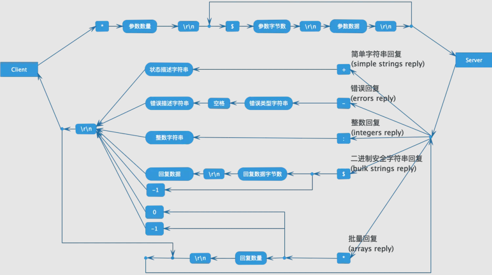

> 注：这是2018年2月写的旧博文，转载到此。

# Redis 协议
Redis客户端和服务端之间使用一种名为RESP(REdis Serialization Protocol)的二进制安全文本协议进行通信。RESP设计的十分精巧，下面是一张完备的协议描述图：



#举个栗子
用SET命令来举例说明RESP协议的格式。
```
redis> SET mykey "Hello"
"OK"
```
实际发送的请求数据：
```
*3\r\n$3\r\nSET\r\n$5\r\nmykey\r\n$5\r\nHello\r\n
```
实际收到的响应数据：
```
+OK\r\n
```
每种命令对应的回复类型，可以查询Redis官网的命令列表[Command reference](https://redis.io/commands)。更详细的协议说明请参考Redis官方协议规范[Redis Protocol specification](https://redis.io/topics/protocol)。

# 参考
[1] 通信协议(protocol)，http://redisdoc.com/topic/protocol.html

[2] Redis Protocol specification，https://redis.io/topics/protocol


版权声明：自由转载-非商用-非衍生-保持署名（[创意共享4.0许可证](https://creativecommons.org/licenses/by-nc-nd/4.0/deed.zh-hans)）