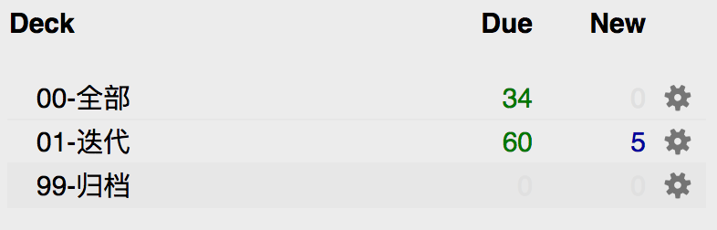

> 注：这是2021年1月写的旧博文，转载到此。

# Anki是什么？
本文假定你是个Anki用户，并不会对Anki基础知识进行介绍。对Anki不熟悉的读者可以阅读Anki英文官网（[Anki - powerful, intelligent flashcards](https://apps.ankiweb.net/)），或Anki中国（[Anki--近乎完美的记忆神器](https://www.ankichina.net/anki20.html)）的介绍内容。

# 正确使用牌组
“正确使用牌组”是[官方 Anki 手册](https://www.ankichina.net/Index/ankishouce)上对 Anki 牌组功能的使用建议，内容如下：
>牌组被设计成将你的内容分成你想单独学习的大类，如英语、地理等等。 你可能会想创建许多小的牌组，以保持你的内容有条理，如“我的地理书第1章”，或“食品动词”，但这是不推荐的，有以下原因：
>
> - 许多小牌组意味着你最终会以可识别的顺序复习卡片。 无论是因为你依次点击每一个牌组（这是缓慢的），或你在一个单一的父级牌组上增加了一些牌组，你最终会看到所有的“第1章”或“食物动词”卡片在一起。 这使得回答卡片更容易，因为你可以从上下文猜测他们，从而导致较弱的记忆。 当你需要回忆单词或Anki外的短语时，你不会有充足的可被证明的相关内容。
> 
> - Anki不是设计来处理许多牌组（超过几十个），它会慢下来，当你添加更多的–尤其是如果你在一个移动客户端的情况下。一些额外的牌组不会产生明显的差异，但是如果你有许多牌组，延误将开始增加。
>
> **使用标签和/或字段来分类内容，替代创建许多小的牌组，这是一个更好的主意。** 例如替代创建一个“食物动词”，你可以把这些卡片添加到你的主要语言学习牌组，并用“食物”和“动词”来标记卡片。每个卡片可以有多个标签，这意味着你可以做的事情，如寻找所有的动词，或所有与食品有关的词汇，或所有的动词与食品有关。
>
>对于那些喜欢保持非常有条理的，您可以添加字段到您的笔记分类的内容，如“书”，“页”等。 Anki支持特定字段的搜索，这意味着你可以做一个“图书搜索：‘我的书’页码：63”马上找到你要找的。
>
>Anki的定制学习和筛选牌组特点使其特别强大，因为你可以从搜索条件创建临时牌组。这允许您在大多数时间（最佳内存）中将内容混合在一个单独的牌组上，同时也需要在特定的材料上创建临时牌组，例如在测试之前。**一般的规则是，如果你总是希望能够单独学习一些内容，它应该是在一个正常的牌组上，如果你只是偶尔需要能够单独学习（测试，有压力时，等），标签/字段和过滤牌组更好。**

由上可知，官方的建议是不要创建许多小分类牌组，使用几个单独学习的大类牌组即可。强迫症患者可以使用标签或字段来细分类内容，替代创建许多小分类牌组。

# 极简牌组结构

|牌组名称|用途|
|-|-|
|00-全部|存放“有效”卡片|
|01-迭代|存放“待修改”卡片|
|99-归档|存放“废弃”卡片|

- 有效：需要学习/复习/记忆的卡片；
- 待修改：内容不好影响记忆效果，需要修改的卡片；
- 废弃：内容过时，已经不需要记忆的卡片；

## “00-全部”牌组
Anki 中的“有效”卡片最终都是要内化到大脑记忆的，那么卡片也就不需要分类了。用易于记忆的方式组织好卡片的内容，记忆到大脑中后，大脑这台高端分类机器会自动分类的。
**过度分类最大的弊端是破坏了“间隔重复算法”的有效性。** 因为不同类别的卡片记忆难度是不同的，人为分类之后，你会常常在不经意间选择记忆轻松简单的牌组，而不是靠“间隔重复算法”自动为你选择当前最需要复习的卡片。
所以，要记忆的“有效”卡片请全都放到“00-全部”牌组。**如果控制不住自己要进行分类，那么问自己“分类通常是为了区分重要程度，既然有不太重要的卡片，直接归档/删除即可，何必要分类？”**

## “01-迭代”牌组
Anki 卡片内容组织方式是使用 Anki 的难点，卡片内容无法一步到位，通常需要多次的迭代修改。如果多次复习某张卡片时都难以回想起来，那么主要有两种可能的原因：

1. 没有理解卡片对应的知识，靠死记硬背；
2. 卡片的内容组织方式不当，大脑难以记忆。 

解决第 1 点问题的方式因人而异，毕竟 Anki 只是记忆工具。如何系统的学习和理解新知识超出了 Anki 的范畴，这方面大家可以求助于讲解学习方法的相关书籍。

第 2 点问题。目前我还没找到“间隔重复”学习理论的专著，只有知乎上的 Anki 爱好者们和 SuperMemo 的博客有一些零星的文章。**卡片内容组织方面，推荐阅读 SuperMemo 的一篇博文《有效学习：组织知识的20条原则》**[[英文](https://www.supermemo.com/en/archives1990-2015/articles/20rules)][[中文](https://www.jianshu.com/p/163462164a5b)]。文章表达的核心观点就是卡片不能把一大堆内容堆砌在卡片中，期望通过间隔重复的方式来记忆，这样是行不通的。卡片的内容要遵循“最小信息原则”，一张卡片只记忆一个极其简单的知识点。

按我的理解，不管是用问答的形式还是填空形式，**一张卡片最好在 5s 内能快速回想出答案，快速、高频、精准的刺激对应的脑回路，才能形成长期记忆。** 问题和答案没啥强关联，想半天想不出答案，或者答案是好几百字的一大段文字等，都是无法记忆的不合格卡片，需要转移到“01-迭代”牌组进行优化拆分后，再回到“00-全部”牌组进行记忆。

## “99-归档”牌组
做卡片不易，要耗费很多时间精力，有时候看到过时无用的卡片不舍得删，所以存在这个牌组。由于存放在这个牌组的卡片都是“废弃”的卡片，所以牌组学习新卡片和复习卡片的数量都设置为“0”，以免出现数字提醒干扰。

## 总结
Anki 虽好，可不要瞎折腾。花太多时间在牌组的结构上就属于没有意义的瞎折腾，钻研卡片的内容组织方式才是对使用 Anki 真正有意义的事情^_^。

# 参考

[1] Anki 2.0 用户手册，[https://www.ankichina.net/Index/ankishouce](https://www.ankichina.net/Index/ankishouce)
[2] 有效学习——组织知识的20个原则，[https://www.jianshu.com/p/163462164a5b](https://www.jianshu.com/p/163462164a5b)

版权声明：自由转载-非商用-非衍生-保持署名（[创意共享3.0许可证](https://creativecommons.org/licenses/by-nc-nd/3.0/deed.zh)）