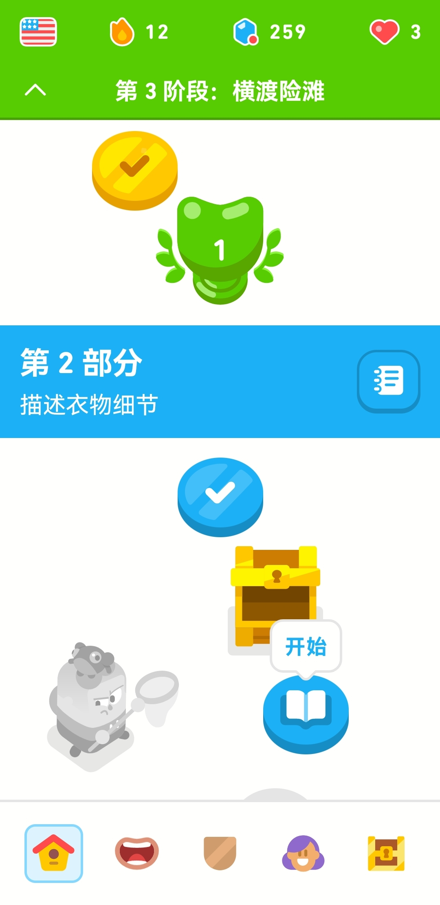

---
title: How long does an adault speak english fluently by english learning applications ?
date: 2023-10-15 11:26:25
tags:
---

I used to learn english by Duolingo.

But Duolingo only has a little speak pratice, so i always try to find an better english speaking app.

At last year, ChatGPT became more and more popular. I thought may be some english learning applications could used the chatgpt's AI feature to make a AI tutor. I searched by google, then i found the application "Speak".It's amazing app! I can speak to AI tutor, just like a real person. 

I think it may be helping me to speak english fluently in six months.

